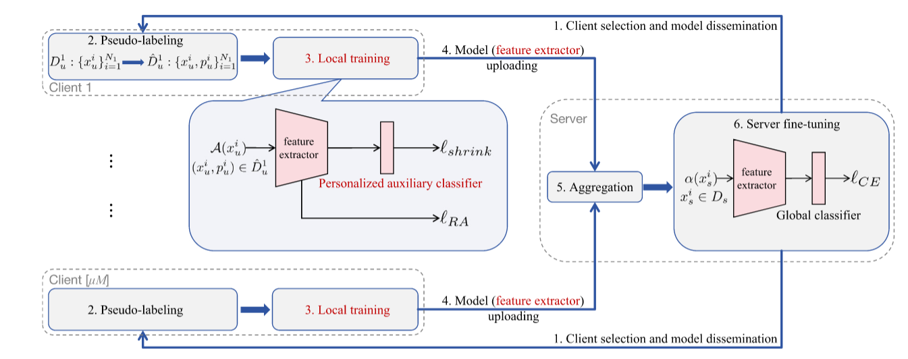
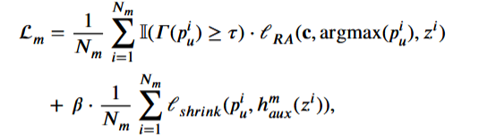

# the method of SSFL in recent years

## debias (Neural Networks)

使用双头分类器，主分类器由高质量伪标签训练，辅助分类器用来训练低质量伪标签，同时为了利用低质量伪标签采用shrinks损失，即对于预测概率相似的类别进行，去除top2类，再归一化，直到伪标签变得自信，同时采用置信度分数作为伪标签的权重分数，损失如下

RA损失可以用logit损失来代替

